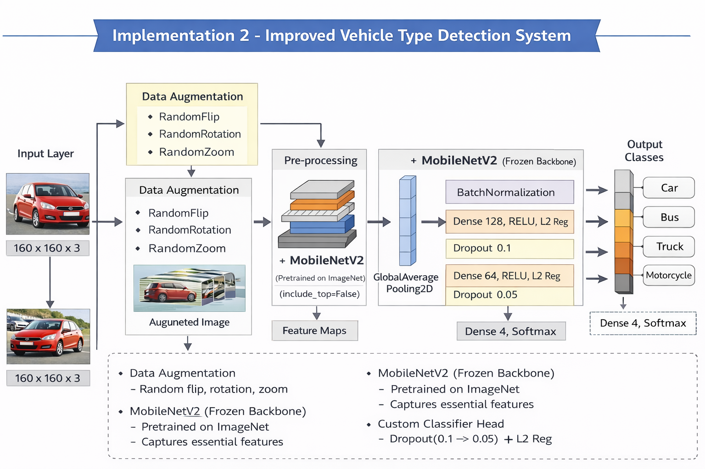
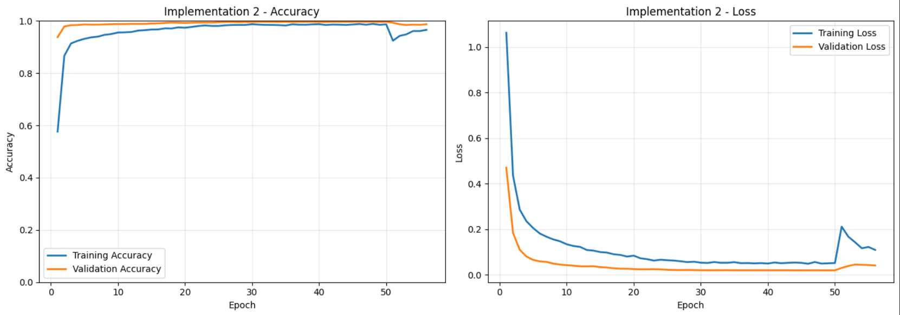
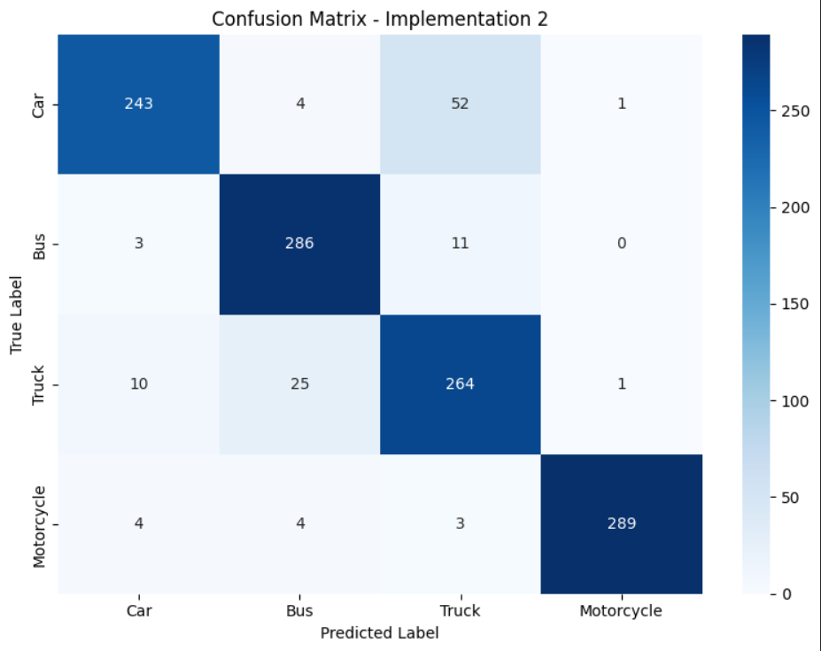
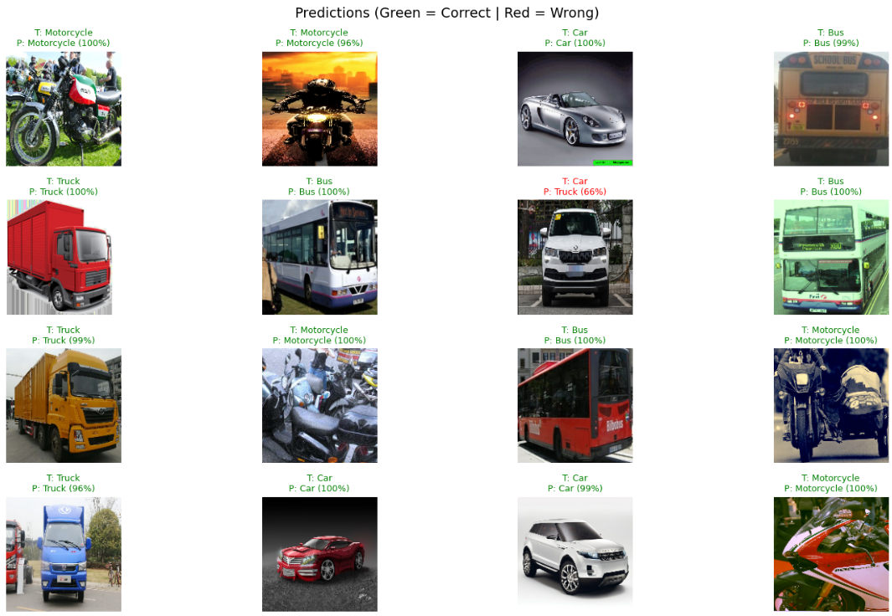

# 🚗 Vehicle Type Detection Using Deep Learning (MobileNetV2)
ICT 3212 – Rajarata University of Sri Lanka | Department of Computing

This project implements a deep learning system to classify vehicle images into **four categories: Car, Bus, Truck, and Motorcycle** using **Transfer Learning with MobileNetV2**.

The goal of this project is to improve vehicle classification performance by comparing a **baseline CNN model (Implementation 1)** with an **improved transfer learning model (Implementation 2)**.

---

# 📋 Project Overview

Vehicle classification is an important task in **traffic monitoring systems, intelligent transportation systems, and smart city applications**.

This project focuses on improving model accuracy and generalization using modern deep learning techniques.

Implementation 2 introduces several improvements over the baseline CNN:

- Transfer learning using **MobileNetV2 pretrained on ImageNet**
- Improved dataset preprocessing and cleaning
- Data augmentation
- Dropout regularization
- Batch normalization
- L2 weight regularization
- Learning rate scheduling
- Early stopping
- Fine-tuning of pretrained layers

These improvements significantly improved model performance and reduced overfitting.

---

# 🎯 Final Results

| Metric | Value |
|------|------|
| Test Accuracy | **90.2%** |
| Macro F1 Score | **0.902** |
| Weighted F1 Score | **0.902** |
| Training Accuracy | **~97%** |
| Best Validation Accuracy | **~99%** |
| Train/Validation Gap | **~2% (Very Low Overfitting)** |

---

# 📊 Per-Class Performance

| Class | Precision | Recall | F1 Score | Support |
|------|------|------|------|------|
| Car | 0.935 | 0.810 | 0.868 | 300 |
| Bus | 0.897 | 0.953 | 0.924 | 300 |
| Truck | 0.800 | 0.880 | 0.838 | 300 |
| Motorcycle | 0.993 | 0.963 | 0.978 | 300 |

### Key Observations

- **Motorcycle classification achieved the highest performance.**
- **Bus detection also performed strongly with high recall.**
- Some confusion occurs between **car and truck classes** due to visual similarity.

---

# 🏗️ Model Architecture

The model uses **MobileNetV2** as a feature extractor with a custom classification head.

### Input

### Architecture

### Advantages

- Faster convergence
- Better feature extraction
- Reduced overfitting
- Improved generalization

---

# ⚙️ Training Configuration

| Parameter | Value |
|------|------|
| Image Size | 160 × 160 |
| Batch Size | 64 |
| Initial Epochs | 50 |
| Fine-Tuning Epochs | 10 |
| Validation Split | 25% |
| Optimizer | Adam |
| Initial Learning Rate | 5e-5 |
| Fine-Tune Learning Rate | 1e-5 |
| Loss Function | Sparse Categorical Crossentropy |
| Number of Classes | 4 |

---

# 🔄 Dataset Preparation

The dataset was cleaned before training by:

- Removing corrupted image files
- Removing unsupported file formats
- Validating images using TensorFlow decode
- Standardizing class folder names
- Resizing images to **160 × 160**

### Dataset Distribution

| Class | Training Images | Testing Images |
|------|------|------|
| Car | 1400 | 300 |
| Bus | 1400 | 300 |
| Truck | 1400 | 300 |
| Motorcycle | 1400 | 300 |

Balanced classes help prevent model bias.

---

# 🔀 Data Augmentation

Data augmentation was applied only to the training dataset.

Techniques used:

- Horizontal Flip
- Small Rotation
- Random Zoom
- Random Transformations

This helps increase dataset diversity and improve model robustness.

---

# 📈 Training Graphs

Training and validation performance during training:

---

# 📊 Confusion Matrix

Confusion matrix for the final model:

Most predictions fall along the **diagonal**, indicating correct classifications.

---

# 🖼️ Sample Predictions

Example predictions generated by the model:

---

# 📁 Repository Structure
vehicle-type-detection
│
├── Vehicle_Type_Detection_Implementation_2.ipynb
│   Main notebook – training and evaluation
│
├── images/
│   ├── training_graphs.png
│   ├── confusion_matrix.png
│   └── sample_predictions.png
│
├── model_v2.h5
│   Final trained model
│
├── requirements.txt
│   Python dependencies
│
├── .gitignore
│   Files excluded from version control
│
└── README.md
    Project documentation

---

# 🚀 Getting Started

### 1️⃣ Clone the Repository

### 2️⃣ Install Dependencies

---

### 3️⃣ Dataset Setup

The notebook expects a dataset stored in Google Drive:

Dataset structure:
vehicle_dataset
├── train
│ ├── car
│ ├── bus
│ ├── truck
│ └── motorcycle
│
└── test
├── car
├── bus
├── truck
└── motorcycle

---

### 4️⃣ Run the Notebook

Recommended environment:

**Google Colab (GPU enabled)**

Open the notebook and run all cells.

---

# 🛠️ Technologies Used

- Python
- TensorFlow / Keras
- NumPy
- Matplotlib
- Seaborn
- scikit-learn
- Google Colab
- MobileNetV2 (Transfer Learning)

---

# 📄 License

This project was developed for **academic purposes** for the course:

**ICT 3212 – Rajarata University of Sri Lanka  
Department of Computing**
